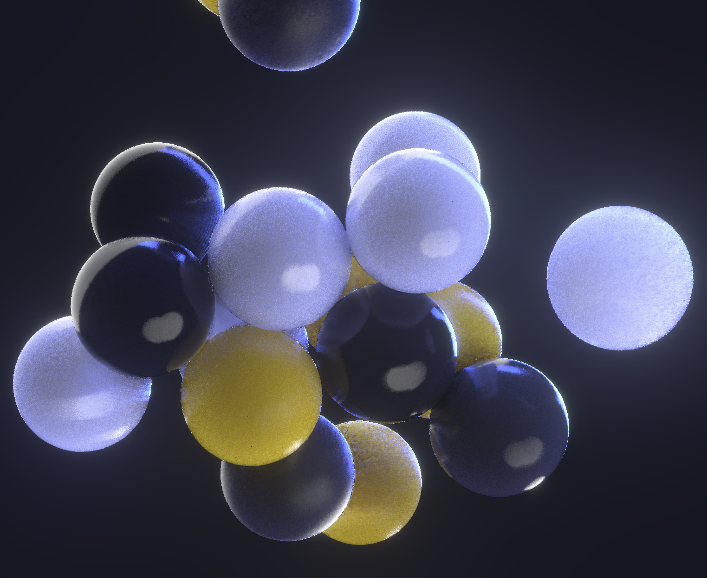

## Notes
The physics is based on [rapier.js](https://github.com/pmndrs/react-three-rapier),
and SSGI is based on [realism-effects](https://github.com/0beqz/realism-effects/issues)

[**Live Demo**](https://momentchan.github.io/r3f-ssgi-physics/)
